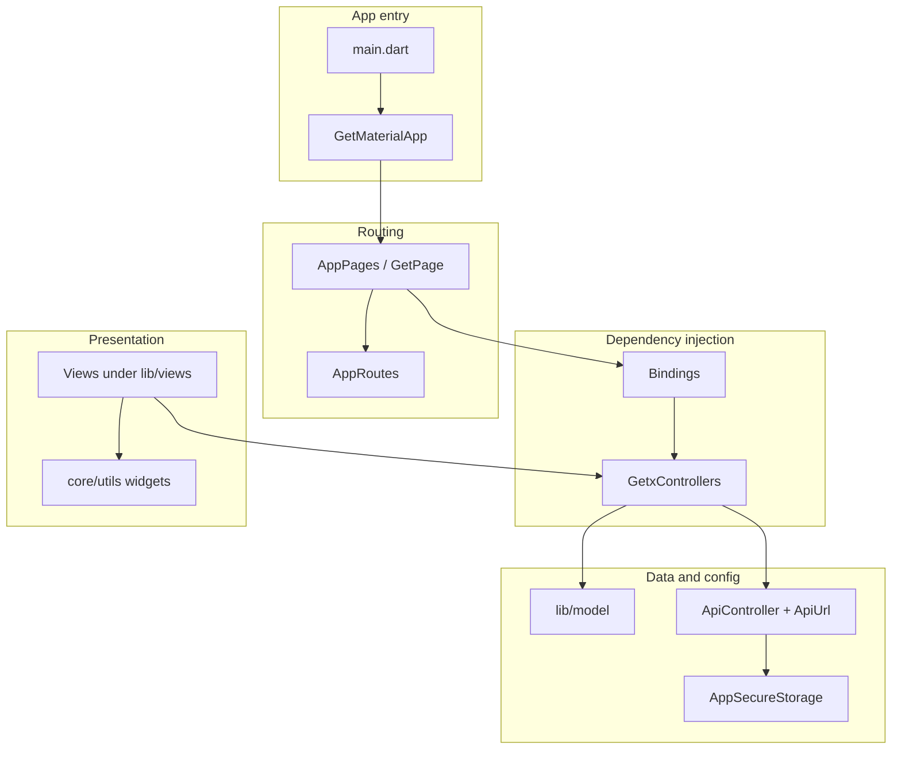

# flip_health

Cross-platform **Flutter** app (FlipHealth) for onboarding, authentication, a services dashboard, and a health checkup flow. The codebase follows a **GetX**-oriented structure: named routes, route-level **bindings** for dependency injection, **controllers** for state and navigation, and **views** for UI.

---

## Tech stack

| Layer | Technology |
|--------|------------|
| Language / SDK | Dart **^3.9.2**, Flutter |
| State management & routing | [get](https://pub.dev/packages/get) (`GetMaterialApp`, `GetPage`, `GetxController`, `Bindings`) |
| HTTP | [dio](https://pub.dev/packages/dio) via `ApiController` |
| Local persistence | [shared_preferences](https://pub.dev/packages/shared_preferences) (`AppSecureStorage`; Flutter Secure Storage is commented out) |
| UI helpers | [flutter_svg](https://pub.dev/packages/flutter_svg), [persistent_bottom_nav_bar](https://pub.dev/packages/persistent_bottom_nav_bar), [animate_do](https://pub.dev/packages/animate_do), [cupertino_icons](https://pub.dev/packages/cupertino_icons) |
| Feedback | [fluttertoast](https://pub.dev/packages/fluttertoast), custom toasts/snackbars in `core` |
| Fonts | **Poppins** family (declared in `pubspec.yaml`) |
| Linting | `flutter_lints` + `analysis_options.yaml` |
| Tests | `flutter_test` (`test/widget_test.dart`) |

**Platforms present in the repo:** `android/`, `ios/` (standard Flutter embedding). Other desktop/web folders may exist per Flutter template; primary mobile targets are Android and iOS.

---

## Architecture

The app uses a **layered + feature-oriented** layout under `lib/`:

1. **Entry:** `main.dart` runs `GetMaterialApp` with `initialRoute: AppRoutes.splash` and `getPages: AppPages.routes`. A global `accessToken` string is used with `ApiController` for `Authorization: Bearer` headers.
2. **Routing:** `AppRoutes` holds path constants; `AppPages` registers `GetPage` entries with optional `binding` and transitions.
3. **Bindings:** Each screen (or feature entry) can register controllers with `Get.lazyPut` when the route is opened.
4. **Controllers:** Extend `GetxController`; hold UI state, `TextEditingController`s, and navigation (`Get.toNamed`, `Get.offAllNamed`, etc.).
5. **Views:** Stateless/Stateful widgets under `lib/views/…`; compose widgets from `core/utils` and feature `widgets/`.
6. **Core:** Shared constants, helpers, reusable widgets, and services (API, storage).
7. **Models:** Plain Dart classes (some with `fromJson` / `toJson`) used by controllers and UI.

**Data flow (simplified):** User action in a **View** → **Controller** → optional **ApiController** / **AppSecureStorage** → UI updates via GetX (reactive fields where used) or imperative updates.



---

## Directory structure (maintained)

Source and assets layout as used by the project (build artifacts and tooling caches are omitted).

```
flip_health/
├── lib/
│   ├── main.dart
│   ├── bindings/
│   │   ├── auth bindings/
│   │   │   └── auth_binding.dart
│   │   ├── dashboard bindings/
│   │   │   └── dashboard_binding.dart
│   │   ├── health checkup bindings/
│   │   │   ├── add_family_member_binding.dart
│   │   │   └── health_checkup_binding.dart
│   │   └── splash binding/
│   │       ├── on_boarding_binding.dart
│   │       └── splash_binding.dart
│   ├── controllers/
│   │   ├── auth controllers/
│   │   │   ├── login_controller.dart
│   │   │   └── otp_controllers.dart
│   │   ├── dashboard controllers/
│   │   │   └── dashboard_controller.dart
│   │   ├── health checkup controllers/
│   │   │   ├── add_family_member_controller.dart
│   │   │   └── health_checkup_controller.dart
│   │   └── splash controller/
│   │       ├── on_boarding_controller.dart
│   │       └── splash_screen_controller.dart
│   ├── core/
│   │   ├── constants/
│   │   │   ├── app_colors.dart
│   │   │   ├── font_family.dart
│   │   │   ├── font_style.dart
│   │   │   └── string_define.dart
│   │   ├── helpers/
│   │   │   ├── app_toasts.dart
│   │   │   ├── app_validators.dart
│   │   │   └── responsive_helpers.dart
│   │   ├── services/
│   │   │   ├── api services/
│   │   │   │   ├── api_controller.dart
│   │   │   │   └── api_urls.dart
│   │   │   └── secure storage/
│   │   │       └── secure_storage.dart
│   │   └── utils/
│   │       ├── action_button.dart
│   │       ├── common_app_bar.dart
│   │       ├── common_bottom_sheet.dart
│   │       ├── common_text.dart
│   │       ├── custom_dropdown.dart
│   │       ├── custom_textfeild.dart
│   │       ├── custom_toast.dart
│   │       ├── payment_success_screen.dart
│   │       └── print_log.dart
│   ├── model/
│   │   ├── dashboard models/
│   │   │   └── service_model.dart
│   │   ├── heath checkup models/
│   │   │   └── family_member_data_model.dart
│   │   └── onboarding models/
│   │       └── onboarding_model.dart
│   ├── routes/
│   │   ├── app_pages.dart
│   │   └── app_routes.dart
│   └── views/
│       ├── auth/login/
│       │   ├── login_screen.dart
│       │   └── otp_screen.dart
│       ├── dashboard/
│       │   ├── dashboard_home_page.dart
│       │   ├── dashboard_screen.dart
│       │   ├── view_more_services.dart
│       │   └── widgets/
│       │       ├── bottom_nav_bar.dart
│       │       ├── dash_board_searchbar.dart
│       │       ├── dashboard_banner.dart
│       │       ├── dashboard_header.dart
│       │       ├── service_card.dart
│       │       ├── service_grid.dart
│       │       └── view_more_button.dart
│       ├── health checkup/
│       │   ├── add_family_member_page.dart
│       │   ├── explore_health_packages_page.dart
│       │   ├── health_checkup_overview_page.dart
│       │   ├── health_checkup_screen.dart
│       │   ├── health_selection_slot_page.dart
│       │   ├── select_plan_page.dart
│       │   └── widgets/
│       │       ├── add_family_member_button.dart
│       │       ├── header_section.dart
│       │       └── user_card.dart
│       └── splash/
│           ├── onboarding_screen.dart
│           └── splash_screen.dart
├── assets/
│   ├── fonts/          # Poppins TTF files
│   ├── lotties/
│   ├── png/
│   └── svg/            # includes onboarding, tab bar, service icons, etc.
├── test/
│   └── widget_test.dart
├── android/            # Android Gradle project
├── ios/                # Xcode / CocoaPods
├── pubspec.yaml
└── analysis_options.yaml
```

**Note:** Several folders use **spaces** in their names (for example `auth bindings`, `api services`). Imports use **URI-encoded** segments (for example `package:flip_health/bindings/auth%20bindings/auth_binding.dart`), which is valid Dart but worth knowing when searching or refactoring.

---

## Models (`lib/model/`)

| File | Role |
|------|------|
| `dashboard models/service_model.dart` | **ServiceModel** — UI-oriented model for dashboard tiles (title, subtitle, badge, asset path, colors, `onPressed`). |
| `onboarding models/onboarding_model.dart` | **OnboardingModel** — image path plus title/subtitle for onboarding slides. |
| `heath checkup models/family_member_data_model.dart` | **FamilyMember** — member id/name, sponsored flags, packages flag, with `fromJson` / `toJson`. |

Additional domain DTOs can be added alongside these files as API usage grows.

---

## Other important files

| Area | Files | Purpose |
|------|--------|---------|
| Routes | `app_routes.dart`, `app_pages.dart` | Central route names and `GetPage` registration with bindings and transitions. |
| API | `api_controller.dart` | Dio setup, headers (Bearer token), GET/POST helpers, token-expiry handling (clears prefs, navigates to login), logging, curl-style debug. |
| API config | `api_urls.dart` | `BASE_URL` and legal links; `kDomain` / `kBaseUrlDomain` are placeholders until configured. |
| Storage | `secure_storage.dart` | SharedPreferences wrapper: keys for token, login flag, FCM token, user id, profile fields, etc. |
| Constants | `string_define.dart`, `app_colors.dart`, font constants | Strings for UI copy and asset paths; theme-related constants. |
| Responsive | `responsive_helpers.dart` | Initialized from `main` / `MyApp` for screen sizing helpers. |
| Tests | `test/widget_test.dart` | Default Flutter widget test harness (update when home flow stabilizes). |

---

## Registered navigation flow (from `AppPages`)

1. **Splash** → **Onboarding** → **Login** → **OTP**  
2. **Dashboard** (with binding) and **All services** (`ServicesScreen`)  
3. **Health checkups** flow and **Add family member** (each with its own binding)

Commented blocks in `app_pages.dart` reserve routes for profile, settings, and error pages.

---

## Getting started

```bash
flutter pub get
flutter run
```

Configure `lib/core/services/api services/api_urls.dart` with real `kDomain` / `kBaseUrlDomain` (or equivalent) before calling live APIs.

For general Flutter help, see the [Flutter documentation](https://docs.flutter.dev/).
